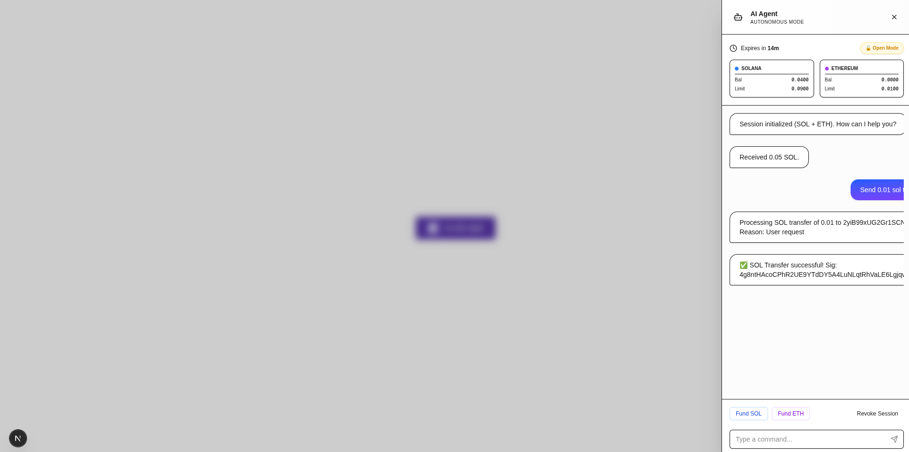
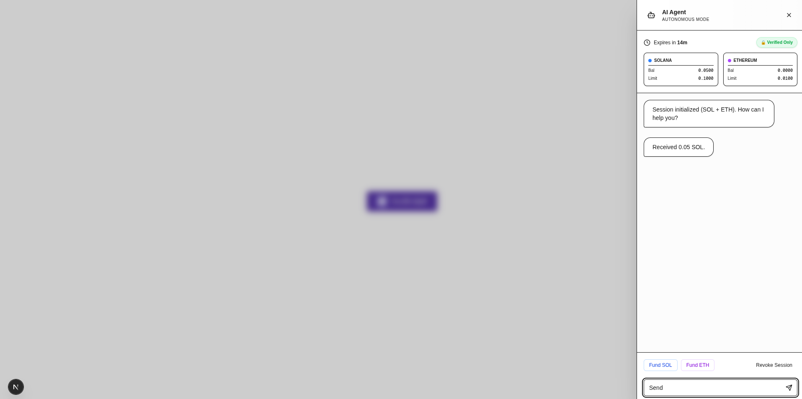
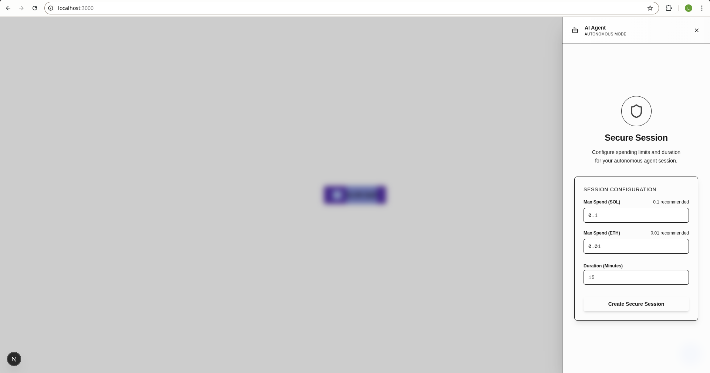
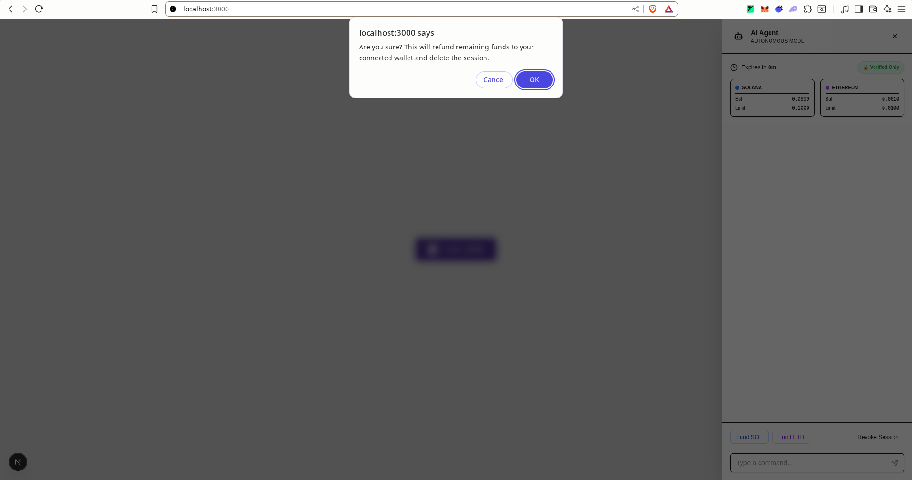

# Agent Protocol Web Example

This project is a reference implementation of a web-based AI Agent interface using **Next.js** and the **Agent Protocol SDK** (`@agent-protocol/core`).

It demonstrates how to build a secure, non-custodial AI agent capable of performing on-chain actions on both Solana and Ethereum using temporary session keys.

## 🌟 Features

- **AI-Driven Interactions**: Chat with an AI agent powered by Google's Gemini Flash model.
- **Multi-Chain Support**: Seamlessly interact with Solana (Devnet) and Ethereum (Sepolia).
- **Session Keys**: Uses ephemeral session keys to allow the AI to sign transactions without prompting the user for every action.
- **Function Calling**: The AI intelligently selects tools to execute, such as transferring assets or checking balances.

## 📸 Screenshots

| Agent Interface | Transaction Flow |
|---|---|
|  |  |
|  |  |

## 🛠️ SDK Usage

This example relies heavily on **`@agent-protocol/core`** for all agentic capabilities. It showcases key SDK patterns:

### 1. Tool Definitions
We import pre-built tools from the SDK to give the AI capabilities:
```typescript
import { transferSOLTool, transferETHTool, getBalanceTool } from "@agent-protocol/core";
```
These tools are passed directly to the LLM (e.g., Gemini) for function calling.

### 2. Session Management
The SDK handles the complexity of generating and restoring session keys:
```typescript
import { generateSessionKeys, restoreSolanaKeypair } from "@agent-protocol/core";

// Generate keys for both chains
const keys = generateSessionKeys(); 
```

### 3. Core Logic
Business logic for transfers and balance checks is imported directly, ensuring consistency and security:
```typescript
import { transferSOL, transferETH, fetchSessionBalances } from "@agent-protocol/core";

// Execute a transfer signed by the session key
await transferSOL(connection, sessionKey, toAddress, amount);
```

## 🚀 Getting Started

### Prerequisites

- Node.js 18+
- pnpm

### Installation

1. Install dependencies from the root of the monorepo:
   ```bash
   pnpm install
   ```

2. Build the core SDK:
   ```bash
   pnpm -r build
   ```

### Configuration

Create a `.env` file in `examples/web` and add your Gemini API Key:

```env
NEXT_PUBLIC_GEMINI_API_KEY=your_gemini_api_key_here
```

### Running the App

Start the development server:
```bash
pnpm dev
# or from root: pnpm dev:web
```

Open [http://localhost:3000](http://localhost:3000) in your browser.

## 📖 How to Use

1. **Connect Wallet**: Connect your Solana wallet (Phantom, Solflare, etc.).
2. **Open Agent**: Click the AI Agent button to open the interface.
3. **Fund Session**:
   - The agent uses a temporary session wallet.
   - Click "Fund" to deposit a small amount of Devnet SOL or Sepolia ETH into the session wallet.
4. **Chat**:
   - Ask the agent to perform tasks: *"Send 0.001 SOL to [address]"*
   - The agent will parse your intent, call the appropriate SDK tool, and execute the transaction instantly.
5. **Revoke**: Context closing or clicking "Revoke" will refund any remaining session funds back to your main wallet.
